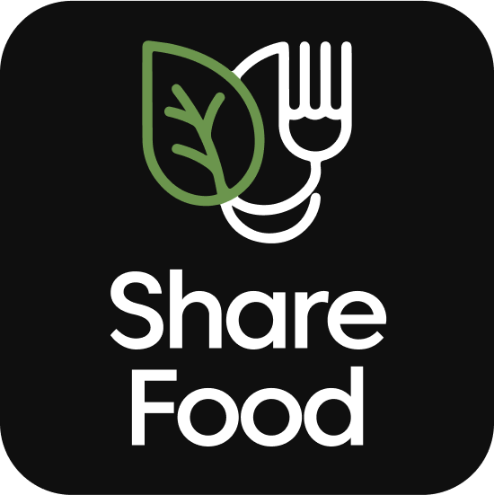

## ShareFood ```Mobile App```

Modern food donation and sharing application built with React Native and Expo.

#### Features

- Food donation management
- Request food donations
- User authentication
- Profile management
- Donation activity
- Search functionality
- Notifications
- Rating and review system

#### Tech Stack

- Frontend Framework: ```React Native```
- Development Platform: ```Expo SDK 52```
- Navigation: ```React Navigation```

#### Project Structure

```
src/
├── components/
├── contexts/
├── hooks/
├── navigation/
├── screens/
├── types/
└── utils/
```

#### Screens
```
- HomeScreen: Main dashboard
- SearchScreen: Search for donations
- AddDonationScreen: Create new donation
- DonationDetailScreen: View donation details
- DonationRequestsScreen: Manage donation requests
- DonationActivityScreen: Track donation activities
- RequestFormScreen: Submit donation requests
- PickupDetailScreen: View pickup information
- ProfileScreen: User profile management
- AccountSettingsScreen: Account settings
- SignInScreen: User login
- SignUpScreen: User registration
- ForgotPasswordScreen: Password recovery
- NotificationsScreen: View notifications
- ReviewRatingScreen: Rate and review donations
- AboutScreen: App information
- FAQScreen: Frequently asked questions
- PrivacyPolicyScreen: Privacy policy
```

#### Prerequisites

- Node.js
- npm or yarn
- Expo CLI
- Expo SDK 52

#### Installation

1. Clone the repository
2. Install dependencies:
   ```bash
   npm install
   ```

3. Start the development server:
   ```bash
   npx expo start
   ```

4. Use expo go on mobile device or use an emulator.

#### Contributors

1. Bahiskara Ananda Arryanto (22081010181)
2. Iko Indra Gunawan (22081010003)
